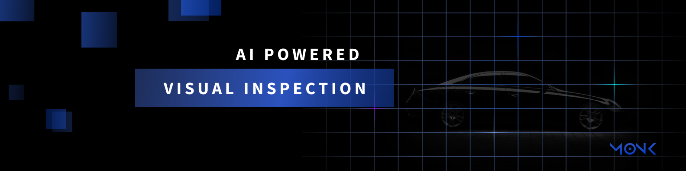

🧿 **Get a fully automated damage report classified by type, car parts, position and severity.**

## 📖 Documentation

* [Getting started](https://monkvision.github.io/monkjs/docs)
  * [🏁 Overview](https://monkvision.github.io/monkjs/docs/)
  * [📦 Installation](https://monkvision.github.io/monkjs/docs/install)
* [Guides](https://monkvision.github.io/monkjs/docs/js/guides/picturing)
  * [📷 Taking pictures](https://monkvision.github.io/monkjs/docs/js/guides/picturing)
  * [🔓 Authenticate](https://monkvision.github.io/monkjs/docs/js/guides/authenticating)
* [🧯 Troubleshooting](https://monkvision.github.io/monkjs/docs/troubleshooting)

## 🪲 Issue Reporting

If you have found a bug or if you have a feature request, please report them at this repository issues section. Please do not report security vulnerabilities on the public GitHub issue tracker. The [Auth0 Responsible Disclosure Program](https://auth0.com/whitehat) details the procedure for disclosing security issues.

For Monk related questions/support please use the [Support Center](https://support.monkvision.ai).

## ⚖️ License

This project is licensed under the Clear BSD license. See the [LICENSE](LICENSE) file for more info.
