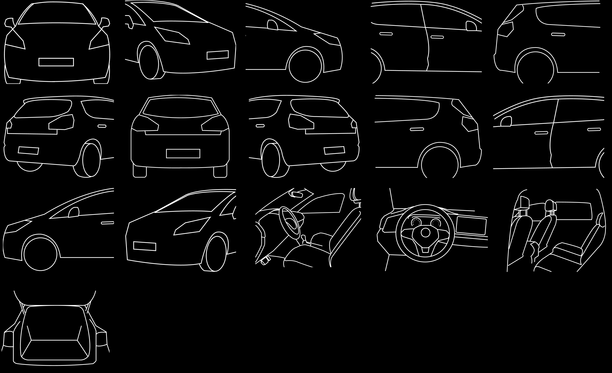
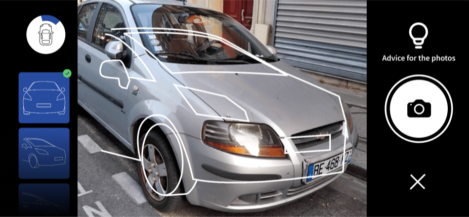

The Camera view takes on a more complete state with **Sights**. We recommend using this `<CameraView />` to take pictures of your vehicles.

``` yarn
yarn add @monkvision/react-native-views @monkvision/corejs @monkvision/react-native
```

⛓️ Peer deps in [`@monkvision/react-native-views/package.json`](https://github.com/monkvision/monkjs/tree/master/packages/react-native-views/package.json)

``` javascript
import { CameraView } from `@monkvision/react-native-views`
```

### Sights

A capture scheme is a list of sights `[Sight]` with a unique string `id` and [cylindrical coordinates](https://en.wikipedia.org/wiki/Cylindrical_coordinate_system) `"(ρφz)"`.

> If our AI can work without this metadata, it analyzes much more easily with it. The Camera view then embeds a list of default sights that you can customize in the near future.

``` json
"id": "abstractFront",
"(ρφz)": {
  "ρ": null,
  "φ": 0,
  "z": null
}
```

Can also be simplified
`const abstractSight = new Sight('abstractFront', [null, 0, null]);`

This scheme will enable a wheel indicator displaying the angle we need to take the picture.
Plus an overlay is completing the view helping to take position before taking the picture.



### Usage

``` javascript
/* MyCameraView.jsx */

import React, { useCallback } from 'react';
import { CameraView } from '@monkvision/react-native-views';

export default function MyCameraView() {

  const handleCloseCamera = useCallback((pictures) => {
    console.log(pictures); // [[Sight, CameraPicture], ...]
  }, []);

  const handleTakePicture = useCallback((picture) => {
    console.log(picture); // [Sight, CameraPicture]
  }, []);

  return (
    <CameraView
      onCloseCamera={handleCloseCamera}
      onTakePicture={handleTakePicture}
      analyzeAfterCapture
    />
  );
}
```

**See the [CameraView API](https://monkvision.github.io/monkjs/js/api/react-native-views#CameraView) to more details.**

### Outputs

``` json
/* picture */

{
  "abstractFront":{
    "sight":{
      "_id":"abstractFront",
      "_poz":[
        null,
        0,
        null
      ]
    },
    "source":{
      "uri":"data:image/png;base64",
      "base64":"data:image/png;base64",
      "width":640,
      "height":480,
      "exif":{
        "aspectRatio":1.3333333333333333,
        "deviceId":"3e472a",
        "frameRate":30.000030517578125,
        "groupId":"cf50a2",
        "height":480,
        "resizeMode":"none",
        "width":640
      }
    }
  }
}
```



